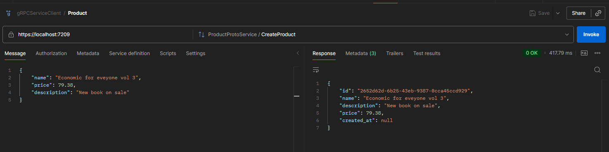

# Demo gRPC Product Service

This project is a simple gRPC service for managing products, built with .NET 8.

## Features

- List all products
- Get a product by ID
- Create a new product
- Update an existing product
- Delete a product

## Requirements

- [.NET 8 SDK](https://dotnet.microsoft.com/download)
- [Visual Studio 2022](https://visualstudio.microsoft.com/vs/)

## Running the Service

1. Clone the repository.
2. Open the solution in Visual Studio 2022.
3. Build and run the project.

## Testing the Service

You can use [Postman](https://www.postman.com/) or any gRPC client to test the endpoints.  
Below is an example request using Postman:

## Protobuf

The service contract is defined in `Protos/product.proto`.

---

**Note:** This project uses an in-memory list for storing products and is intended for demonstration purposes only.
